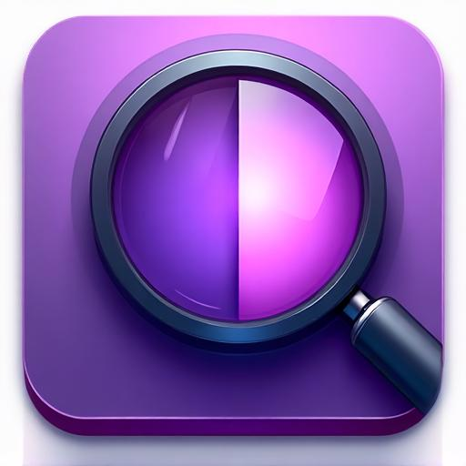

# Split Magnifier - Professional Screen Magnification Tool

A sophisticated desktop application for magnifying screen content with split-screen functionality, built with React and Electron.



## 🚀 Features

- **Split-Screen Display** - Vertical and horizontal split layouts
- **Real-Time Magnification** - 2x to 5x zoom levels with smooth rendering
- **Interactive Focus Area** - Drag and resize the magnification region
- **Professional Interface** - Dark theme with intuitive controls
- **Keyboard Shortcuts** - Full hotkey support for power users
- **Cross-Platform** - Windows, macOS, and Linux support

## 🖥️ Desktop Application

This project includes a complete **Windows installer setup** using Electron:

- ✅ Native Windows `.exe` installer
- ✅ Professional NSIS-based installation
- ✅ Desktop shortcuts and Start Menu integration
- ✅ Auto-updater ready for distribution
- ✅ Code-signing ready for commercial use

## 📦 Quick Installation (Windows)

### For End Users
1. Download the `.exe` installer from releases
2. Run the installer and follow the setup wizard
3. Launch "Split Magnifier" from your desktop or Start Menu

### For Developers
See [`WINDOWS_INSTALLER_SETUP.md`](WINDOWS_INSTALLER_SETUP.md) for complete build instructions.

**Quick Build:**
```bash
git clone <your-repo>
cd <project>
npm install
# Add electron scripts to package.json (see setup guide)
npm run electron:dist:win
```

## 🎮 Usage

### Web Version
1. Visit the live demo at your deployed URL
2. Use toolbar controls to adjust zoom and split orientation
3. Drag the focus area to select magnification region

### Desktop Version
- **Ctrl+T** - Toggle magnifier on/off
- **Ctrl+Plus/Minus** - Increase/decrease zoom
- **Ctrl+1/2** - Switch between vertical/horizontal split
- **Ctrl+R** - Reset focus area
- **F11** - Toggle full screen

## 🛠️ Technology Stack

- **Frontend**: React 18 + TypeScript + Vite
- **UI Components**: Radix UI + shadcn/ui
- **Styling**: Tailwind CSS with custom design system
- **Desktop**: Electron with secure preload scripts
- **Build**: electron-builder for cross-platform packaging
- **Icons**: AI-generated professional icon set

## 📁 Project Structure

```
split-magnifier/
├── src/
│   ├── components/
│   │   ├── MagnifierApp.tsx        # Main application component
│   │   ├── MagnifierToolbar.tsx    # Controls and settings
│   │   ├── MagnifiedView.tsx       # Left panel magnification
│   │   ├── SimulatedContent.tsx    # Right panel content
│   │   └── FocusSelector.tsx       # Interactive focus area
│   └── pages/Index.tsx
├── electron/
│   ├── main.js                     # Electron main process
│   └── preload.js                  # Secure IPC communication
├── build-resources/
│   ├── icon.png                    # App icon (512x512)
│   ├── icon.ico                    # Windows icon
│   └── license.txt                 # MIT license
└── scripts/
    └── build-icons.js              # Icon generation
```

## 🎨 Design System

The app features a professional dark theme with:

- **Primary Color**: Purple (#8b5cf6) with gradients
- **Background**: Dark grays with subtle variations
- **Typography**: System fonts with careful hierarchy
- **Animations**: Smooth focus pulse and hover effects
- **Accessibility**: High contrast and keyboard navigation

## 🔧 Development

### Web Development
```bash
npm install
npm run dev
```

### Electron Development
```bash
npm run electron:dev
```

### Build Production
```bash
# Web build
npm run build

# Windows installer
npm run electron:dist:win

# All platforms
npm run electron:dist
```

## 📋 System Requirements

### Web Version
- Modern browser with ES2020 support
- Minimum 1024x768 screen resolution

### Desktop Version
- **Windows**: Windows 10+ (x64/x86)
- **macOS**: macOS 10.14+ (Intel/Apple Silicon)
- **Linux**: Ubuntu 18.04+ or equivalent

## 🤝 Contributing

1. Fork the repository
2. Create a feature branch
3. Make your changes
4. Test thoroughly (web and desktop)
5. Submit a pull request

## 📄 License

MIT License - see [LICENSE](build-resources/license.txt) for details.

## 🆘 Support

- **Setup Issues**: See [`WINDOWS_INSTALLER_SETUP.md`](WINDOWS_INSTALLER_SETUP.md)
- **Quick Start**: See [`QUICK_START.md`](QUICK_START.md)
- **Bug Reports**: Create an issue with system details
- **Feature Requests**: Describe your use case and requirements

---

**Professional Screen Magnification Made Simple** 🔍